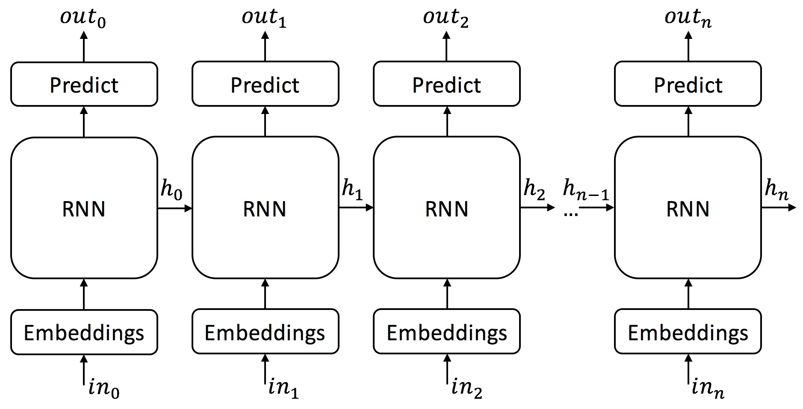
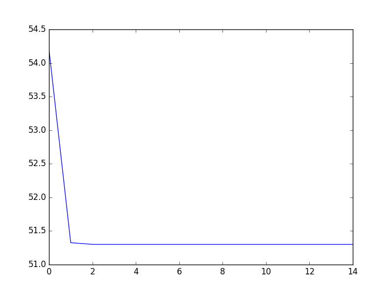
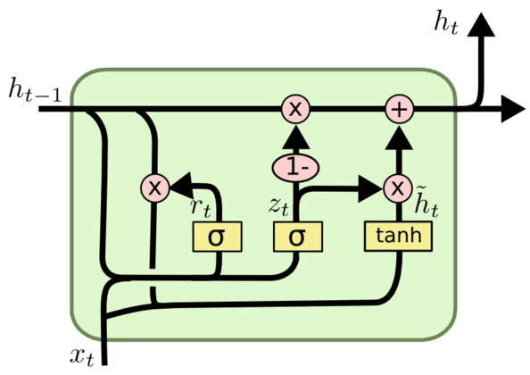

# NewsGenerator

## Contents
[About](#about)  
[Data Set](#data-set)  
[Data Preprocessing](#data-preprocessing)  
[Models Info](#models-info)  
[Vanilla RNN](#vanilla-rnn)  
[GRU](#gru)  
[Conclusion](#conclusion)  
[References](#references)
## About

This project aims to generate fake news using machine learning model (RNN). This project aims to compare the power of the short term rnn (Vanilla RNN) and Long term rnn (GRU). Both the models are implmented from scratch (only using numpy).

## Data Set

The data set contains news title as tweeted by the Times of India on twitter.The data was collected for the purpose of [this](https://github.com/breejesh/project_alpha) awesome project, for any query regarding data collection contact [Breejesh Rathod](https://github.com/breejesh).

## Data Preprocessing

The data set contains around 3 Lakh news titles as tweeted by The Times of India, some of them is enlisted below  
* Tax officials claim 'evidence' against Kolkata Knight Riders http://toi.in/aRGFUZ  
* Delhi's Lajpat Nagar blast: Three accused sentenced to death http://toi.in/9vkch5  
* Abandoned car triggers panic at airport

The number of data points that the model was trained on was kept limited (around 40-50k)

The data preprocessing included
* Removing all links and replacing it with 1 common link (as the vocabulary has to be built).
* Start and End token were appended to the sentences and the sentences were tokenized.
* Vocabulary is built and the words in the sentences are replaced by the respective index in the vocabulary list.
* One hot vectors were built, and the preprocessed data was pickled.
* The the length of each sentence was equlized by adding the end token as the filler word.

** Params **
* vocab size: 2000
* data points: 30000

[This](preprocessor.py) is the code of the preprocessing phase.

## Models Info

* The models are trained on the google cloud platform
50 gb ram, 8 cores.
* Different versions of the models were trained, I'll be talking about the version that I found was best.
* The task at hand is to build many to many RNN.
* In the code both the versions of truncated backpropogation through time is implmented (tf style bptt, and the trut tbptt, links in the resources)
* The models were trained in a parallel fashion using the [joblib](https://pypi.python.org/pypi/joblib) module of python.
* Mini batch gradient descent was used for training.

## Vanilla RNN

** Parameters **

[This](params.json) is the stucture of params file
* **Hidden Nodes:** 128
* **Loss Function:** Softmax loss
* **Activation Function:** tanh
* **Optimization:** Adam
* **Layers:** 1
* **Sequence length:** 30
* **Batch Size:** 128

The below graph is Loss vs Iteration  
This is the loss at every 3rd iterations

The models was trained for 45 epochs, using the tensorflow style bptt.Below are some of the generated headlines during training

**Epoch 0**  
* Watch law shows leave century leave sign leave leave game Of This
* firm Supreme Kyi attend changes activist spent ministry train ministry CRPF No

**Epoch 5**  
* US may assembly : US likely wins Mary : child Barack Obama
* Just in : political rise : could Pawar https://examplearticle/exres/abcd.com

**Epoch 20**
* MS Dhoni the China says finance help Headley World Cup : alert
* grow of Taliban https//examplearticle/exres/abcd.com

**Epoch 25**
* Shah Rukh Khan shot dead
* India Sri Lanka conspiracy , https//examplearticle/exres/abcd.com

The most of the sentences doesn't make sense but, the model atleast learnt to complete the names (eg barrack obama, sharukh khan)

Finally after training below are some selected news title that was generated by the model
* IPL 4 : India relief Deccan Chargers
* Shah Rukh Khan 's used to be KKR's owner
* Hazare in Pakistan https//examplearticle/exres/abcd.com
* Nadal in jail

The major observation that was made that vanilla rnn fails to generate longer sentences that actually makes sense, as it fails to learn long term dependencies.

[This](RNN.py) is the code file for vanilla rnn cell.  
[This](generated) folder contains generated titles.

## GRU

The architechture diagram is given below

  

The Gru cell used  

The parameters used were same as that of the vanilla rnn, in this case truncated backprop was not used, full forward and the backward pass was made
The model was trained for 100 iterations

Below are some of the generated headlines during training

**Epoch 20**
* Poll 16 for shut ! The Best 28 near
* sends cause tough paise France feel https//examplearticle/exres/abcd.com Chidambaram old situation

**Epoch 40**
* Odisha killer Arun thrash legal points reported by a local
* 4 men die on may 8 https//examplearticle/exres/abcd.com areas

**Epoch 60**
* unveils Who quits Abdullah world The legal rates eye Food On meeting https//examplearticle/exres/abcd.com
* 9.20pm sends security Italian Newshour clear feel do T20

**Epoch 80**
* Netherlands telecom hints novelty |impacts Hyderabad
* visa hikes in noida https//examplearticle/exres/abcd.com

The model somewhat learnt long term dependencies, but the results were below the expectations

Finally after training below are some selected news title that was generated by the model
* Kalmadi fishermen rapes an European
* Hazare says https//examplearticle/exres/abcd.com
* PM daughter killed https//examplearticle/exres/abcd.com
* IITs track Laxman's plane https//examplearticle/exres/abcd.com

[This](Gru.py) is the gru code file  
[This](GruCell.py) is the cell of the gru  
[This](generated) folder contains the generated sentences

## Conclusion

* The data set contained maximum of 40 words in a news title.
* vanilla rnn performed better than gru as there were no longer sequences that the gru could model.
* Both the models learnt to put the names correctly in the news.
* The models learnt the punctuations.
* Gru is not useful to model shorter sequences

This repo also contains the code for the lstm cell

## References
* https://www.youtube.com/watch?v=BwmddtPFWtA&t=15s
* https://www.youtube.com/watch?v=9zhrxE5PQgY&t=328s
* http://www.wildml.com/2015/09/recurrent-neural-networks-tutorial-part-1-introduction-to-rnns/
* http://colah.github.io/posts/2015-08-Understanding-LSTMs/
* https://medium.com/@camrongodbout/recurrent-neural-networks-for-beginners-7aca4e933b82
* https://machinelearningmastery.com/truncated-backpropagation-through-time-in-keras/
* https://machinelearningmastery.com/gentle-introduction-backpropagation-time/
* https://deeplearning4j.org/lstm.html
* https://r2rt.com/styles-of-truncated-backpropagation.html
